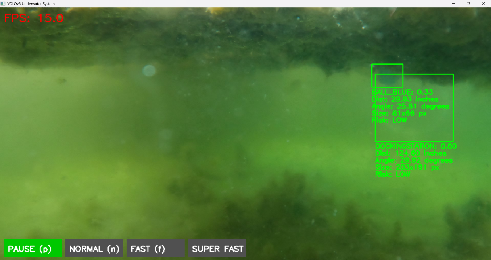

# Underwater Computer Vision System

This project is an end-to-end underwater processing system built for the Synergia Hackathon. It processes optical underwater footage in real-time to detect, track, and analyze objects. The system displays an annotated output with bounding boxes, object class, confidence, and real-time calculations for distance, bearing, and risk.



*(This is a demo of the project detecting objects)*

---

## Features

* **Real-time Object Detection:** Utilizes a trained YOLOv8n model to detect 9 classes of underwater objects.
* **Live Camera Feed:** Can process a live feed directly from a USB webcam for real-time, onboard deployment.
* **Object Tracking:** Tracks unique objects from frame to frame.
* **Distance Estimation:** Calculates the distance (in inches) to an object based on its known real-world height.
* **Bearing Angle Estimation:** Calculates the horizontal angle (in degrees) from the camera's center to the object.
* **Risk Scoring:** Assigns a "Low," "Medium," or "High" risk score to each object based on its class and proximity. Bounding boxes are color-coded based on risk.
* **CSV Data Logging:** Exports all detection data (frame, class, distance, bearing, etc.) to a `.csv` file for external analysis.
* **Interactive UI:** Provides an on-screen UI with clickable buttons for "Pause," "Normal," "Fast," and "Super Fast" playback.

---

## Phase 1: Model & Dataset

* **Model:** YOLOv8n (nano)
* **Dataset Source:** The video data and test footage for this project are provided via this Google Drive link:
    [**Project Dataset & Videos**](https://drive.google.com/drive/folders/1gm4H2dS3ZpozmAOmk73TfCcGhZsvulR6?usp=sharing&pli=1)
* **Classes:** The model was trained on 9 classes:
    1.  `DockingStation`
    2.  `Ball_Red`
    3.  `Ball_Blue`
    4.  `Bottle`
    5.  `Box`
    6.  `Rock`
    7.  `Cable`
    8.  `Thread`
    9.  `Other`

---

## Phase 2/3: System Implementation

The core system is built in Python using OpenCV and the Ultralytics library.

* **Camera Parameters:** The system does not use on-site calibration. Per the requirements, it uses the manufacturer's nominal specifications for the **Blue Robotics Low-Light HD USB Camera (CAM-USB-WIDE-R1)**:
    * **Resolution:** 1920x1080 (processed at 1280x720 for speed)
    * **Horizontal FOV:** 80°
* **Distance/Bearing Formulas:** The system uses these known specs to calculate metrics based on the evaluator-provided formulas.

---

## Hardware & Software Requirements

* **GPU:** An **NVIDIA GPU** (e.g., RTX 3050 or better) is required for real-time performance.
* **OS:** Windows 10/11
* **Python:** 3.10 - 3.12 (Python 3.13 may have issues with some libraries)
* **FFmpeg:** Required for video file pre-processing (if not using a live camera).

---

## Installation

1.  **Clone the Repository:**
    ```bash
    git clone https://github.com/nothariharan/synergia.git
    cd synergia
    ```

2.  **Install PyTorch (GPU Version):**
    This is the most critical step. You must install the version of PyTorch that matches your GPU's CUDA version.
    * **Uninstall old versions:** `pip uninstall torch torchvision torchaudio`
    * **Go to:** [https://pytorch.org/get-started/locally/](https://pytorch.org/get-started/locally/)
    * **Select:** `Stable`, `Windows`, `Pip`, `Python`, and `CUDA 12.x`
    * Run the generated command (e.g., `pip3 install torch torchvision torchaudio --index-url https://download.pytorch.org/whl/cu121`).

3.  **Install Dependencies:**
    Install the rest of the required Python libraries.
    ```bash
    pip install -r requirements.txt
    ```

---

## Execution

1.  **Download the Model:**
    This repository does not include the large model file. Download the trained `yolov8n.pt` file from:
    **[<-- will provide after hackathon -->]**
    Place the `yolov8n.pt` file in this project's main folder.

2.  **Configure the Script:**
    Open `run_underwater.py` and `find_camera.py`.

3.  **Run Mode 1: Live Camera (Default)**
    * In `run_underwater.py`, make sure the `VIDEO_FILE` variable is set to a camera index (e.g., `VIDEO_FILE = 0`).
    * Run the script:
        ```bash
        python run_underwater.py
        ```

4.  **Run Mode 2: Pre-recorded Video**
    * **Prepare Video:** You must first remove the audio stream from your test video.
        ```bash
        # (Requires FFmpeg to be installed)
        ffmpeg -i test1.MP4 -c:v copy -an test1_clean.mp4
        ```
    * **Configure Script:** In `run_underwater.py`, change `VIDEO_FILE` to the name of your clean video.
        ```python
        VIDEO_FILE = 'test1_clean.mp4'
        ```
    * Run the script:
        ```bash
        python run_underwater.py
        ```

### Troubleshooting (Live Camera)

If you run the script in "Live Camera" mode and get a **black screen, an error, or no feed**:

1.  Make sure all other apps (Zoom, Teams, etc.) are closed.
2.  Run the included troubleshooting script:
    ```bash
    python find_camera.py
    ```
3.  This script will test all camera indexes and drivers. It will output a success message like:
    `SUCCESS: Camera found at index 0 (Default Driver)`
    or
    `SUCCESS: Camera found at index 1 (DSHOW Driver)`
4.  Open `run_underwater.py` and modify the `cap = cv2.VideoCapture(...)` line (around line 235) to match the successful settings from the test.
    * **Example 1:** If the test said "index 1 (DSHOW)", change `VIDEO_FILE = 1` and `cap = cv2.VideoCapture(VIDEO_FILE + cv2.CAP_DSHOW)`.
    * **Example 2:** If the test said "index 0 (Default)", change `VIDEO_FILE = 0` and `cap = cv2.VideoCapture(VIDEO_FILE)`.

---

## System Controls

* **UI Buttons:** Click the buttons on the bottom-left of the screen to change speed.
    * **PAUSE (p):** Pauses the video.
    * **NORMAL (n):** Plays at 1x speed, processing every frame.
    * **FAST (f):** Skips frames for faster playback.
    * **SUPER FAST:** Skips even more frames.
* **Keyboard:**
    * **`q`**: Quits the application.

## Output

The system generates a file named **`detection_log.csv`** (or a timestamped file like `log_2025-11-06_07-10-15.csv` for live sessions). This file contains a frame-by-frame log of every object detected, including its class, confidence, distance, bearing, and risk score.